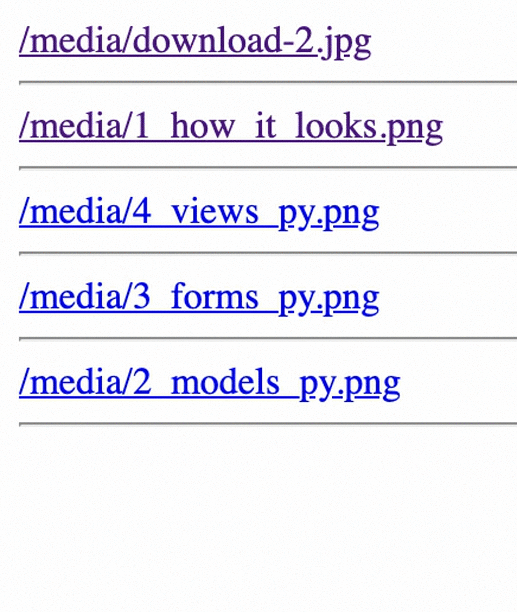
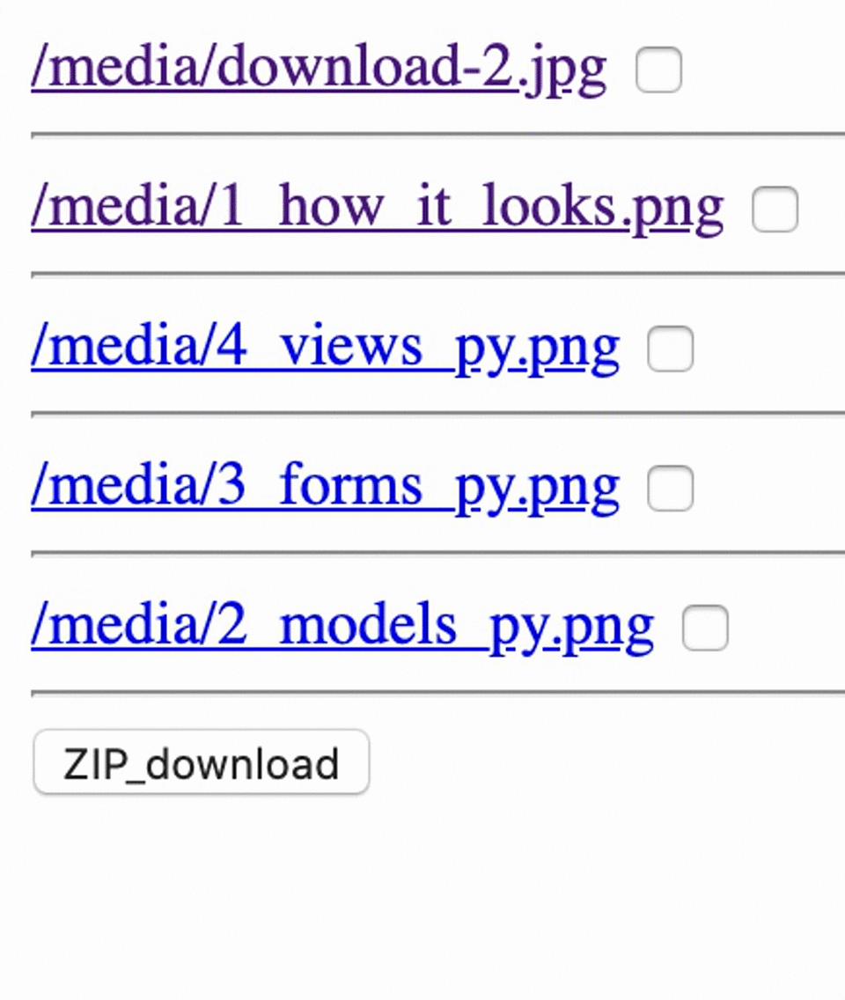

# Django_File_Downloading

referred blog
https://narito.ninja/blog/detail/93/






> ## models.py
``` python
from django.db import models


class UploadFile(models.Model):
    file = models.FileField('file')

    def __str__(self):
        return self.file.url
```

> ## admin.py
``` python
from django.contrib import admin
from .models import UploadFile

admin.site.register(UploadFile)
```

> ## views.py
``` python
import mimetypes
import shutil
from django.http import HttpResponse
from django.shortcuts import get_object_or_404
from django.views import generic
from .models import UploadFile


class UploadList(generic.ListView):
    model = UploadFile


# def download(request, pk):
#     upload_file = get_object_or_404(UploadFile, pk=pk)
#     file = upload_file.file  # get file itself
#     name = file.name  # get file name

#     # guess mimetype from file name, if there is no extension in a file, application/octet-stream
#     response = HttpResponse(content_type=mimetypes.guess_type(name)[0] or 'application/octet-stream')

#     # forcing download by setting Content-Disposition
#     response['Content-Disposition'] = f'attachment; filename={name}'

#     # writing content into HttpResponse
#     shutil.copyfileobj(file, response)

#     return response


# Shorter way by using FileResponse
from django.http import FileResponse

def download(request, pk):
    upload_file = get_object_or_404(UploadFile, pk=pk)
    file = upload_file.file  # get file itselt
    # return FileResponse(file) # when you want to see file on browser
    return FileResponse(file, as_attachment=True)  # when you want to download


import zipfile
def download_zip(request):
    file_pks = request.POST.getlist('zip')  # this is referring to the names in <input type="checkbox" name="zip"
    upload_files = UploadFile.objects.filter(pk__in=file_pks)

    response = HttpResponse(content_type='application/zip')
    file_zip = zipfile.ZipFile(response, 'w')
    for upload_file in upload_files:
        file_zip.writestr(upload_file.file.name, upload_file.file.read())

    # forcing download by setting Content-Disposition
    response['Content-Disposition'] = 'attachment; filename="files.zip"'

    return response

```

> ## urls.py
``` python
from django.urls import path
from . import views

app_name = 'app'

urlpatterns = [
    path('', views.UploadList.as_view(), name='upload_list'),
    path('download/<int:pk>/', views.download, name='download'),  # this is for download view
    path('download/zip/', views.download_zip, name='download_zip'),  # this is for download_zip
]
```

> ## uploadfile_list.html
``` python
<!-- 
        <a href="">{{ uploadfile }}</a>
        <hr>

 -->


<form action="" method="POST">
        
            <a href="">{{ uploadfile }}</a>
            <input type="checkbox" name="zip" value="{{ uploadfile.pk }}">
            <hr>
        
        
        <button type="submit">ZIP_download</button>
</form>
```
